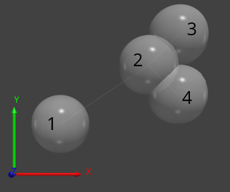

# NeuronMorphologyQuantification
Code accompanying the manuscript "In-vivo quantitative image analysis of age-related morphological changes of C. elegans neurons reveals a correlation between neurite bending and novel neurite outgrowths" by Hess et al.

# Data
You can download the full dataset from [Zenodo](https://zenodo.org/record/2350066#.XBd7YWhKiUk).

```bash
NeuronMorphologyQuantificationData
├── ALM
│   ├── images
|   │   ├── CONDITION_AGE_SERIES_NAME.tif
|   │   └── ...
│   └── trees
|       ├── CONDITION_AGE_SERIES_NAME.swc
|       └── ...
└── PLM
    ├── images
    │   ├── CONDITION_AGE_SERIES_NAME.tif
    │   └── ...
    └── trees
        ├── CONDITION_AGE_SERIES_NAME.swc
        └── ...
```
Preprocessed images can be found in the 'images' folder. The 'trees' folders contain neuron tracings from the APP2 algorithm with manual annotations.

# Requirements
- [Python 3.6](https://www.python.org/downloads/)
- The following python packages* 
  * numpy 1.16.2
  * matplotlib 3.0.3
  * scipy 1.2.1
  * scikit-image 0.15.0
  * SimpleITK 1.2.0
  * tqdm 4.31.1
  
*All these packages can be automatically installed with [pip](https://pip.pypa.io/en/stable/installing/) by running `pip install -r requirements.txt` on the code directory

# Instructions
1. Clone the repository and download the full data from [Zenodo](https://zenodo.org/record/2350066#.XBd7YWhKiUk)
2. In *batchProcessing.py* set the parameter **root** to the directory containing the data
3. Run the script *batchProcessing.py*

# Output
## Measurement Files:
- *root/yyyy-mm-dd_hh-mm-ss_IndividualMeasurements.csv*\
  Contains individual length measurements of structures (i. e. soma-outgrowths)
- *root/yyyy-mm-dd_hh-mm-ss_SummaryMeasurements.csv*\
  Contains mesaruements corresponding to individual neurons (i. e. sharp-bend counts)
- *root/yyyy-mm-dd_hh-mm-ss_Parameters.txt*\
  Contains a copy of the parameters used
## Visualizations
- *root/(ALM|PLM)/classifiedtrees/*\
  This folder contains *.swc* files with classified nodes.
- *root/(ALM|PLM)/wavytrees/*\
  This folder contains *.swc* files with sharp bends and beads visualised.

You can use software like [neuTube](https://www.neutracing.com/) to visualize the results.

# Internal use of the *.swc* format
## General
The *.swc* format allows representation tree structures and is the most common output format of neuron tracing algorithms. 
The following table contains an example of four connected nodes and a corresponding
visualization. 

| Index | Type | X | Y | Z | Radius | Parent |
|-------|------|---|---|---|--------|--------|
| 1 | 0 | 0 | 0 | 0 | 2 | -1 |
| 2 | 0 | 3 | 2 | 0 | 1 | 1 |
| 3 | 0 | 4 | 3 | 0 | 2 | 2 |
| 4 | 0 | 4 | 1 | 0 | 2 | 2 |



We use *.swc* files in this work as *(1)* input trees (neuron tracing output with manual 
annotations), to *(2)* visualize the results of our classification
 and to *(3)* visualize the quantification of kinks and bends. Neuronal trees are internally represented as 
 ```numpy.ndarrays``` of shape ```(7, n_nodes)```.

## Input Annotations
Our pipeline expects *.swc* files with the types of all nodes set to 0. To annotate **PVM-connections** (PLM-sidebranches that connect to the PVM 
neuron that cannot be differentiated from neurite-outgrowths) set the types of one or more of their nodes to **1 or 2**. If
a **crossing PVM process** is not properly detected as such you can annotate it by setting one or more nodes to **3**.

## Output Annotations
### Classification
Classified neuron trees (*../classifiedtrees*) have the following naming convention:

| Structure | Type | Description|
|-------|------|--------|
| Soma node | 0 | Beloning to soma. |
| Mainbranch | 1 | Belonging to main branch. |
| Neurite outgrowth | 2 | Belonging to process sprouting from main branch. |
| Soma outgrowth | 3 | Belonging to process sprouting from soma node. |
| Blob | 5 | Sharp bend in process that is not an outgrowth event. |
| PVM-crossing | 6 | Process of PVM neuron that crosses the PLM neuron. |
| PVM-connection | 7 | Regular connection(s) (1-2) to PVM neurons (no branching event). |
| Unknown | 9 | None of the above. |
| Silenced outgrowth | 10 | Outgrowth event in the first or last segment of the mainbranch, silenced as in those regions a lot of tracing errors occur.

### Wavyness
For the visualization of wavyness (*../wavytrees/COND_AGE_SERIES_NAME.swc*) the radii of all nodes of the mainbranch are set to 0.5. The type
of a node corresponts to the mapping of its angle (0-180 degrees) to an integer in the range 1-10 inclusive. The radii
of nodes detected as sharp bends are set to 3.

### Beads
Visualization of beads (*../wavytrees/COND_AGE_SERIES_NAME_beads.swc*) is done by doubling
the radius of the bead-nodes and setting their type to 1.
